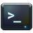
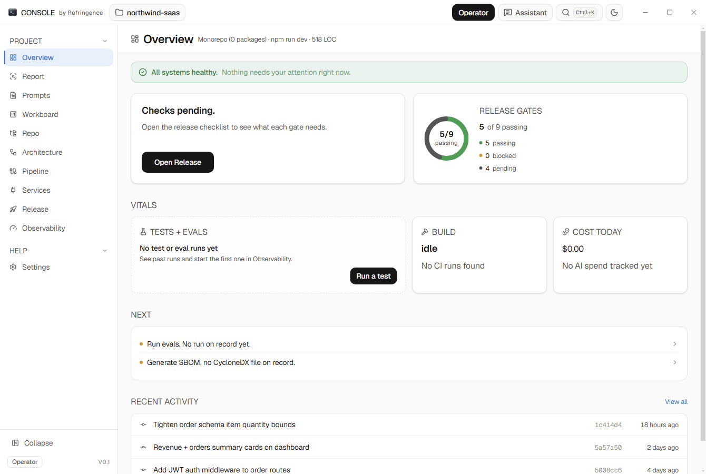
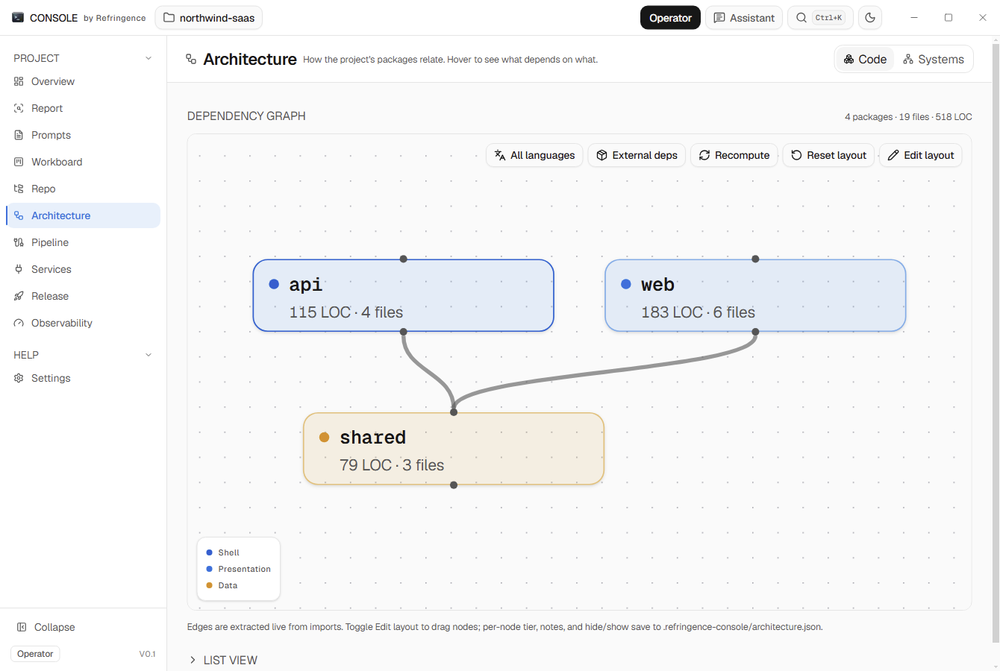

<div align="center">
  

  <h1>Console</h1>

  <p><em>by Refringence</em></p>

  <p>A local-first developer command-center that opens any repo and runs its dev workflows in one window.</p>

  <p>
    <a href="LICENSE.md"></a>
    
    
    
  </p>
</div>



---

Console reads a project from disk and gives you one window for the
things you would otherwise chase across a terminal, a browser, and several SaaS
dashboards: what the repo is and how to run it, its live dependency graph, the
issue board, CI runs you can trigger, service connections, release gates, and
test and eval runs you can launch and watch stream. No backend, no telemetry, no
account. Windows, macOS, and Linux.

> Console started as an internal tool for building Refringence and is now its own
> project.

## What it is, and who it is for

Two kinds of developer hit the same wall from opposite sides.

Someone learning to ship can produce working code with an AI assistant but
stalls at the last mile: wiring CI, connecting a deploy target, reading a
stranger's repo, knowing what to do next. A senior engineer can do all of that
but loses time to the tab-per-concern sprawl of GitHub, a host dashboard, an
error tracker, and a local test runner.

Console serves both from one build through two personas:

- **Guided** writes for the person learning to ship. Prose orientation, one
  clear next action, walkthroughs with live in-app demos, and the real CI and
  deploy flow run from inside the app instead of a passive tour.
- **Operator** writes for the senior engineer. A dense, status-first surface:
  quick filters, one-click actions, direct links, minimal chrome.

The split is real, not a density toggle. Guided hides power surfaces; Operator
hides the narrative. Both reach every panel through Ctrl+K.

It works on any local repo. It runs offline. It needs no account. Any-repo
detection infers project type, start command, and capabilities from
`package.json`, `pyproject.toml`, `Cargo.toml`, `go.mod`, `Dockerfile`, and
workspace markers, so the panels seed correctly on whatever project you open.

## Features

Each panel reads real files from the open project and degrades to an honest
empty state when a signal is absent (no CI yet, no services connected yet).

- **Overview**: a prose summary of the project (type, start command, language,
  package count, lines of code), current health, a few real numbers, and the
  next action.
- **Report**: a deep read of the open project from one tree walk, no AI
  required: the language histogram, the tech stack (frontend, backend, runtimes,
  build tools, package manager, monorepo-aware across workspace packages), file
  and LOC metrics, detected services with the evidence that implies them (`.env`
  key names, dependencies, config files, `.mcp.json` servers) and a confidence,
  the AI tooling in use (MCP servers, SDKs, eval frameworks, agent configs), and
  a health rollup. With a connected AI provider it adds a plain-English read of
  what the project is *about*, prioritized suggestions, and a semantic systems
  map; without one it stays fully useful and degrades honestly.
- **Workboard**: issues and PRs as a Kanban board plus a table, synced from the
  project's GitHub remote via the `gh` CLI. Drag a card across columns to
  relabel the issue in place.
- **Repo**: orientation over file size. What the project is, how to run it,
  structure grouped by role, entry points, and key scripts.
- **Architecture**: two views over the same project. *Code* is a live dependency
  graph extracted from the actual imports (TS and JS), laid out with ELK, colored
  by tier, with cycle detection; annotate, pin, and save a curated overlay on top
  of the auto-graph. *Systems* is an AI-generated semantic map of named systems
  placed on real repository paths (every path validated against the tree), so a
  clicked system opens real code.
- **Pipeline**: CI and CD jobs with live status and logs; trigger workflow runs
  from the panel. Detects Vercel and Netlify so the deploy story sits in one
  place.
- **Services**: GitHub, Vercel, and Sentry connections with live status and
  actions, so a missing dependency is a visible state rather than a silent
  failure.
- **Release**: a gate checklist and ship-readiness rollup from
  `release/<version>.yaml`. Each gate names a real artifact (a workflow run, a
  report, a tag, a signed binary) and the summary is never greener than its
  weakest gate.
- **Observability**: QA and test-run artifacts with one-click runs (evals, e2e,
  smoke, CI) that stream into a live console and refresh the runs table on
  completion.
- **Tutorials**: a stepped carousel of walkthroughs, each with a live miniature
  of the real component it teaches, not a screenshot.
- **Docs**: sectioned, visual documentation where the examples are live,
  scaled-down Console components that never go stale.
- **Library**: an in-app reader for the repo's own docs and config files;
  markdown rendered in place, no external file open.

Two personas, Guided and Operator, switch at any time. Multiple windows can hold
multiple projects at once.

First run walks you through a short, calm setup: sign in (optional), pick how AI
runs (your own provider key or a local Ollama model), point Console at a project
and watch it read the code live, then see what it learned, choose your goals, and
connect your services. See [docs/ONBOARDING.md](docs/ONBOARDING.md).



## Install

Console ships as a normal desktop app. Two ways to get it:

**Download the installer** (recommended) — grab the latest build for your OS from
the [Releases page](https://github.com/Refringence-AI/console/releases/latest):
Windows `.exe` (NSIS), macOS `.dmg`, or Linux `.AppImage` / `.deb`. Windows and
Linux builds are currently unsigned, so you may see a SmartScreen / Gatekeeper
prompt on first launch — choose "Run anyway". The Windows installer also presents
the FSL-1.1-Apache-2.0 license for you to accept before it installs.

**Or install from the terminal.** A one-line installer pulls the latest release
for your OS — no package manager, nothing to pay for:

```powershell
# Windows (PowerShell)
irm https://raw.githubusercontent.com/Refringence-AI/console/main/install.ps1 | iex
```

```bash
# Linux
curl -fsSL https://raw.githubusercontent.com/Refringence-AI/console/main/install.sh | bash
```

Package managers also work once the first release is out:

```bash
winget install Console            # Windows
scoop install console             # Windows (self-hosted bucket)
brew install --cask console       # macOS (needs a notarized build)
```

Console auto-updates from GitHub Releases once installed; on Windows and Linux a
"Restart to update" button appears in the top bar when a new version is ready.

## Build from source

Prerequisites:

- Node 22 or newer.
- The GitHub `gh` CLI, authenticated (`gh auth login`), for the Workboard panel.

Each workspace has its own `package.json`:

```bash
git clone https://github.com/Refringence-AI/console
cd console
npm install --prefix console-shell
npm install --prefix console-electron
npm install --prefix qa
node qa/scripts/patch-playwright-node24.js
```

Run the built app, or the dev build with Vite HMR:

```bash
# Built: compile the renderer and main, then launch Electron.
npm --prefix console-electron run start

# Dev: Vite on http://localhost:5174 in one shell, Electron in another.
npm --prefix console-shell run dev
npm --prefix console-electron run dev
```

On Windows, `scripts/launch-console.ps1` wraps both flows (`-Build` to rebuild,
`-Dev` for HMR). It strips `ELECTRON_RUN_AS_NODE` from the spawn environment;
some dev shells (Cursor, certain WSL setups) inherit it, which puts Electron in
Node-only mode and breaks boot.

Open a project from the sidebar (or pass a path to the `console` launcher once
installed). Console remembers your recent projects per window.

## Project layout

```
console/
├── console-electron/        Electron 35 main process (TypeScript, CJS-tsc'd)
│   └── src/main/ipc/         one handler module per panel
│       └── index.ts          handler registry
├── console-shell/           React 19 + Vite 7 + Tailwind v4 + shadcn renderer
│   ├── src/views/            one folder per panel (+ a Guided/Operator pair)
│   └── src/lib/bridge.ts     typed IPC contract for window.refringenceConsole
├── packages/
│   └── design-tokens/        shared CSS design tokens
├── qa/                      Playwright e2e (serial, one Electron process per spec)
├── docs/                    per-area deep dives
└── scripts/                launchers
```

The renderer never touches Node or the filesystem. Every panel calls a typed
method on `window.refringenceConsole` (defined in
`console-shell/src/lib/bridge.ts`), which the preload forwards to a handler under
`console-electron/src/main/ipc/`. The renderer queries with TanStack Query 5 and
routes with React Router 7.

## Testing

```bash
cd qa
npx playwright test --project=console --workers=1
```

Specs run serially on one worker; each spawns a full Electron process, and
parallel spawns hit OS resource limits.

## Contributing

Issues and PRs are welcome. See [CONTRIBUTING.md](CONTRIBUTING.md) for dev setup,
the four-file IPC rule, the commit and writing conventions, and the checks to run
before opening a PR. [SECURITY.md](SECURITY.md) covers how to report a
vulnerability.

## License

[FSL-1.1-Apache-2.0](LICENSE.md). The source is available now under the
Functional Source License; the same code converts to Apache-2.0 two years after
each version's release.
